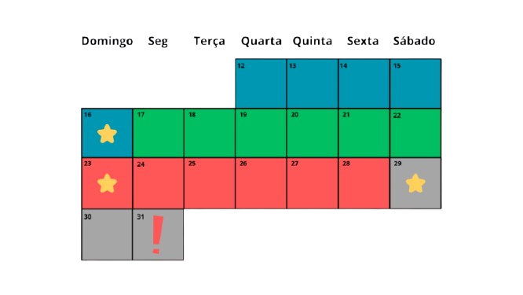

# 📺 TP_PUCFlix

O projeto PUCFlix é um cadastro de séries e episódios, com uma interface textual para mostrar os registros. O nosso projeto é uma implementação simples de um Banco de Dados sem utilizar um SGBD, contendo todas as operações de CRUD (Create, Read, Update e Delete) para as duas entidades, garantindo seus relacionamentos.

# ‼️ Checklist

(Marcar posteriormente com ✅) 
+ As operações de inclusão, busca, alteração e exclusão de séries estão implementadas e funcionando corretamente? ✅
+ As operações de inclusão, busca, alteração e exclusão de episódios, por série, estão implementadas e funcionando corretamente? ✅
+ Essas operações usam a classe CRUD genérica para a construção do arquivo e as classes Tabela Hash Extensível e Árvore B+ como índices diretos e indiretos? ✅
+ O atributo de ID de série, como chave estrangeira, foi criado na classe de episódios?✅
+ Há uma árvore B+ que registre o relacionamento 1:N entre episódios e séries?✅
+ Há uma visualização das séries que mostre os episódios por temporada?✅
+ A remoção de séries checa se há algum episódio vinculado a ela?✅
+ A inclusão da série em um episódio se limita às séries existentes?✅
+ O trabalho está funcionando corretamente?✅
+ O trabalho está completo?✅
+ O trabalho é original e não a cópia de um trabalho de outro grupo?✅

# 📦 Classes do sistema

Uma breve descrição de cada classe do Sistema, organizado semelhante à pastas de arquivos do projeto. Cada Classe com a descrição de todas as funções e atributos

### Principal

Classe principal do projeto, possuindo apenas duas funções: main e povoar. A função povoar realiza o povoar() de cada visão. Já a função main() cria a primeira interface com, atualmente, 4 opções, as duas primeiras opções leva para a classe de visão respectiva da classe escolhida, a terceira opção para chamar o povoar() e a última para encerrar o programa. Por fim, o único atributo dessa classe é a String versão, que tem o formato "x.x", onde x é um dígito

## Entidades

### Serie

Classe para criar a Entidade Serie. Implementa a interface EntidadeArquivo

#### Atributos

+ ID (int)
+ nome (String)
+ anoLancamento (int -> 4 dígitos)
+ sinopse (String)
+ streaming (String)
+ nota (int -> 0:10)
+ criadores (ArrayList de String)
+ genero (String)

#### Funções

+ Set e get de todos os atributos
+ 3 Construtores = Um com parâmetros vazio, Um parâmetros para cada atributos e outro com parâmetros para cada atributo sem o id (colocando o valor como -1), no final, todas vão chamar o construtor com todos os atributos. Validar todas as informações no construtor completo, porém permitindo que construa com os valores “vazios”.
+ toString( ): Formato tabelado, com uma linha para cada atributo, com o nome “completo” e gramaticalmente correto. Para a formação da tabela, preencher com pontos (‘.’) até o atributo com maior nome. Começar cada linha com ‘| ’ e terminar com ‘ |’, preenchendo com espaços em branco para manter as | alinhadas. Além disso, no começo e no final da função, colocar a sequência de (“+---+”) englobando todos as informações. Ex.:
```
+--------------------------+
| ID...............: 1     |
| Nome.............: XXXXX |
| Temporada........: 2     |
| Ano de lançamento: 2020  |
|            ...           |
+--------------------------+
```
+ byte [ ] toByteArray( ): Função para retornar um arranjo de bytes dado uma instância da classe, registrar os atributos na mesma ordem acima.
+ fromByteArray(byte[ ]): Função para preencher um objeto com dados vindo de um arranjo de bytes.

### Episodio

Classe para criar a Entidade Episódio. Implementa a interface EntidadeArquivo

#### Atributos

+ ID (int)
+ IDSerie (int)
+ nome (String)
+ temporada (byte)
+ dataLancamento (LocalDate)
+ duracao (float) (em minutos)
+ nota (byte -> 0:10)
+ diretores (ArrayList de String)

#### Funções
+ Set e get dos atributos
+ 3 Construtores = Um com parâmetros vazio, Um parâmetros para cada atributos e outro com parâmetros para cada atributo sem o id (colocando o valor como -1). no final, todas vão chamar o construtor com todos os atributos. Validar todas as informações no construtor completo, porém permitindo que construa com os valores “vazios”. Para validar a IDSerie chamar a função ControleSerie.validarSerie( ) 
+ toString( ): Formato tabelado, com uma linha para cada atributo, com o nome “completo” e gramaticalmente correto. Para a formação da tabela, preencher com pontos (‘.’) até o atributo com maior nome. Começar cada linha com ‘| ’ e terminar com ‘ |’, preenchendo com espaços em branco para manter as | alinhadas. Além disso, no começo e no final da função, colocar a sequência de (“+---+”) englobando todos as informações. Ex.:
```
+---------------------------------+
| ID................: 1           |
| Nome..............: XXXXX       |
| Temporada.........: 2           |
| Data de lançamento: 11/11/2021  |
|            ...                  |
+---------------------------------+
```
+ byte [ ] toByteArray( ): Função para retornar um arranjo de bytes dado uma instância da classe, registrar os atributos na mesma ordem acima.
+ fromByteArray(byte[ ]): Função para preencher um objeto com dados vindo de um arranjo de bytes.

## Controle

Classes que realiza a mediação entre as operações dos arquivos e a entrada de dados da Visão

### ControleSerie

#### Atributos

+ ArquivoSerie arqSerie

#### Funções

+ incluirSerie(Serie serie): Função que vai inserir serie no banco de dados.
+ excluirSerie(int id): Função para excluir serie por ID. Testar antes de deletar se tem algum episodio dessa serie usando ControleEpisodio.verificarEpisodiosSerie( )
+ excluirSerie(String nome): Função para excluir serie pelo nome.
+ alterarSerie (int id): Função para alterar algum valor da Serie. Usar ID para identificar a Serie a ser excluida, depois a função lerSerie( ) para criar a nova versão do objeto
+ buscarSerie(int id): Função que recebe um ID e retorna um Objeto Serie
+ buscarSerie(String entrada): Função que retorna um ou mais episódio que contém a sequência inserida.Ex. : Entrada: “Era” -> retorna [Serie Era uma vez, Serie Era do Gelo]
+ buscarSerieEpisodios(Serie serie): Função que mostra todos os Episódios da Série
+ buscarSerieEpisodiosPorTemporada(int temporada): Função que mostra os episódios de uma certa temporada de uma série
+ validarSerie(int id): Função estática que recebe um id de Série como parâmetro e retorna True ou False de acordo com sua existência válida no banco de dados. Para a leitura do objeto, instanciar um novo ArquivoSerie e usar o seu read com o id.
+ povoar( ): Primeiro carregamento de dados para o sistema.

### ControleEpisodio

#### Atributos

+ ArquivoEpisodio arqEpisodio
+ Serie serie

#### Funções

+ Construtor: Pede uma Série válida como parâmetro
+ incluirEpisodio(Episodio e): Função para insirir Episódio e utilizando os métodos de ArquivoEpisodio 
+ excluirEpisodio(int id): Função para excluir Episodio por ID. Testar se o episódio é válido para remoção(existe no bd e o id pertence a série)
+ excluirEpisodio(String entrada): Função para excluir Episodio pelo nome. Testar se o episódio é válido para remoção(existe no bd e o id pertence a série)
+ excluirEpisodio(int id, int temp): Função para excluir Episodio por ID de uma temporada. Testar se o episódio é válido para remoção(existe no bd, pertence a série e está na temporada especificada)
+ excluirEpisodio(String entrada, int temp): Função para excluir Episodio pelo nome de uma temporada. Testar se o episódio é válido para remoção(existe no bd, pertence a série e está na temporada especificada)
+ alterarEpisodio(Episodio e): Função para alterar algum valor da Episodio.
+ buscarEpisodio(): Função que retorna todos os episódios da série
+ buscarEpisodio(int id): Função que busca um objeto Episódio pelo ID e retorna caso esteja na série.
+ buscarEpisodio(String entrada): Função que le um nome e retorna um episódio que contém a sequência inserida que está na série especificada. Pode receber mais de um objeto da funcao do arqEpisodio.
+ buscarEpisodioTemporada(int temp): Função que retorna uma lista de episódios que estão na sérieAtual e presentes na temporada temp.
+ buscarEpisodio(int id, int temp): Função que busca um objeto Episódio pelo ID e retorna caso esteja na série e na temporada.
+ buscarEpisodio(String entrada, int temp): Função que le um nome e retorna um episódio que contém a sequência inserida que está na série e na temporada especificada. Pode receber mais de um objeto da funcao do arqEpisodio.
+ verificarEpisodiosSerie( ): Função estática que, com um ID de Série, retorna verdadeiro ou falso se tiver um ou mais episódios atrelados a essa série.
+ povoar( ): Primeiro carregamento de dados para o sistema.

## Visao

Classes para fazer o controle de Entradas e Saídas do Sistema para cada Entidade

### VisaoSerie

#### Atributos

+ private static Scanner console = new Scanner(System.in);

#### Funções

+ menu( ): Função que cria um menu, pede uma entrada de dados enquanto for diferente de 0. Para cada valor entre 1 e 5, realizar certas funções de CRUD, opções como excluir deve chamar função visaoSerie.excluir() que faz a escolha entre excluir por nome ou por ID. Estética:
```
PucFlix v(versao)
--------------------------
> Início > Séries
1 - Incluir
2 - Excluir 
3 - Alterar
4 - Buscar séries
5 - Buscar episódios
0 - Sair
```
+ lerSerie( ): Função para ler uma entrada de dados com suas devidas verificações e gerar um objeto da Classe Serie e retorna-lo, caso objeto não seja válido, levantar exceção. O questioário deve ter seguinte forma:
“Qual o/a (atributo) (tipo do atributo e/ou regras/formato)? ” para cada atributo. Ao final, pedir uma confirmação com (S/N)
+ mostrarSerie(Serie s): Chama o toString da classe Serie
+ incluirSerie( ): Chama a função ControleSerie.incluirSerie() passando o resultado de lerSerie como parâmetro. Mostrar mensagem de sucesso ou falha
+ excluirSerie( ): Função para chamar ControleSerie.excluirSerie(). Chamar buscarUmaSerie() e utilizar retorno como parâmetro em ControleSerie.excluirSerie(). Mostrar mensagem de sucesso ou falha
+ alterarSerie( ): Função para chamar ControleSerie.alterarSerie(). Chamar buscarUmaSerie() e utilizar retorno como parâmetro em ControleSerie.alterarSerie(). Mostrar mensagem de sucesso ou falha.
+ buscarUmaSerie(): Chamar buscarSerie e caso retorno seja uma lista com mais de 1 valor, deve apresentar um menu de escolhas dos resultados obtidos para escolher apenas um. Mostrar mensagem de sucesso (a própria função mostrarSerie()) ou falha
+ buscarSerie(): Primeiramente, realiza uma pergunta para o usuário decidir se a busca é por ID ou por Nome, depois, chamar a função respectiva a escolha da classe ControleSerie. "1. Buscar por ID\n 2. Buscar por Nome". Mostrar mensagem de sucesso (a própria função mostrarSerie()) ou falha
+ buscarEpisodiosSerie( ): Primeiramente, chama por buscarUmaSerie() e, caso retorne um objeto válido, realiza uma pergunta para o usuário decidir se a busca é para todos os episódios de uma Serie ou para uma temporada específica, depois, chamar a função respectiva a escolha da classe ControleSerie. Caso a escolha seja por 2, primeiramente fazer uma entrada perguntando a temporada desejada "1. Buscar todos os episódios\n 2. Buscar episódios de uma temporada". Mostrar os episódios chamando VisaoEpisodio.mostrarEpisodio()
+ povoar( ): Chama função do controle para povoar dados

### VisaoEpisodio

#### Atributos

+ private static Scanner console = new Scanner(System.in);
+ Serie serieAtual
+ int temporadaAtual
+ VisaoSerie visaoSerie

#### Funções

+ menu( ): Função que cria um menu, pede uma entrada de dados enquanto for diferente de 0. Em primeira instância, deve ser feita a escolha de qual série será trabalhada, depois, para cada valor entre 1 e 5, realizar certas funções de CRUD, opções como excluir deve chamar função visaoEpisodio.excluir() que faz a escolha entre excluir por nome ou por ID. (Lembrete: sempre quando voltar, zerar a serieAtual e temporadaAtual)Estética:
```
PucFlix v(versao)          ->  PucFlix v(versao)
--------------------------     --------------------------
> Início > Episódios           > Início > Episódios > "Nome da série"
1 - Escolher Série             1 - Incluir
0 - Voltar                     2 - Excluir
                               3 - Alterar
                               4 - Buscar
                               5 - Escolher Temporada
                               0 - Voltar
```
+ lerEpisodio( ): Função para ler uma entrada de dados com suas devidas verificações e gerar um objeto da Classe Episodio e retorna-lo, caso objeto não seja válido, levantar exceção. Caso valor de temporadaAtual seja diferente de 0, ele será o valor atribuido à variável temporada do episódio, caso contrário, perguntar no questionário. O questioário deve ter seguinte forma:
“Qual o/a (atributo) (tipo do atributo e/ou regras/formato)? ” para cada atributo. Ao final, pedir uma confirmação com (S/N)
+ escolherSerie( ): Função para entrar em uma série que será realizada as opções de CRUD, chamar VisaoSerie.buscarSerie( ) e salvar no atributo serieAtual 
+ mostrarEpisodio(Episodio e): Chama o toString da classe Episodio
+ incluirEpisodio( ): Chama a função ControleEpisodio.incluirEpisodio() passando o resultado de lerSerie como parâmetro. Mostrar mensagem de sucesso ou falha
+ excluirEpisodio( ): Função para chamar ControleEpisodio.excluirEpisodio(). Chamar buscarUmEpisodio() e utilizar retorno como parâmetro em ControleEpisodio.excluirEpisodio(). Mostrar mensagem de sucesso ou falha
+ alterarEpisodio( ): Função para chamar ControleEpisodio.alterarEpisodio(). Chamar buscarUmEpisodio() e utilizar retorno como parâmetro em ControleEpisodio.alterarEpisodio(). Mostrar mensagem de sucesso ou falha
+ buscarEpisodio( ): Primeiramente, realiza uma pergunta para o usuário decidir se a busca é por ID ou por Nome, depois, chamar a função respectiva a escolha da classe ControleEpisodio. "1. Buscar por ID\n 2. Buscar por Nome\n 3. Buscar por Temporada\n 4. Buscar todos da série". Mostrar mensagem de sucesso (a própria função mostrarSerie()) ou falha. Caso temporadaAtual seja diferente de 0, as opções mudam para -> "1. Buscar por ID\n 2. Buscar por Nome\n 3. Buscar todos", onde as funções são da ControleEpisodio com o parâmetro de int temporada adicional(Para o buscar todos, usar buscarTemporada).
+ buscarUmEpisodio( ): Chamar o buscarEpisodio() e caso retorno seja uma lista com mais de um objeto, criar um menu de seleção para escolher apenas um valor e retorná-lo
+ escolherTemporada( ): Primeiramente, pede uma entrada de dados de um int temporada. Realiza a verificação se é uma temporada válida e mostra um submenu com todas as opções anteriores, atualizar a variavel temporadaAtual e o "caminho" 
+ povoar( ): Chama função do controle para povoar dados

## Modelo

Classes para o tratamento dos arquivos, como expecializações da classe Arquivo e Classes de Pares para o uso dos índices

### ArquivoSerie extends Arquivo<Serie>

#### Atributos

+ Arquivo <Episodio> arqSerie
+ ArvoreBMais<ParNomeId> indiceNome;
+ HashExtensivel <ParIDID> indiceSerieEpisodio

#### Funções

+ Contrutor: Chamando o super( ) e também inicializando a ArvoreBMais e o HashExtensivel (Se o Hash já existir, não sobrescrever) 
+ read(string nome): Função que recebe uma string de Nome e faz a pesquisa no bd, retornando todos os episódios que começam com a sequência da entrada.
+ readEpisodios(int IDSerie): Função que retorna todos os episódios da serie. Utilizar nova instância ArquivoEpisodios para isso. 
+ Sobrescrever os métodos create( ), update( ), delete( ) para fazerem as devidas alterações na ArvoreBMais e no HashExtensivel. Testar ao deletar se série tem episódio, caso tenha mostrar erro e abordar função.

### ArquivoEpisodio extends Arquivo<Episodio>


#### Atributos

+ Arquivo <Episodio> arqEpisodio
+ ArvoreBMais<ParNomeId> indiceNome;
+ HashExtensivel <ParIdId> indiceSerieEpisodio

#### Funções

+ Contrutor: Chamando o super( ) e também inicializando a ArvoreBMais e o HashExtensivel (Se o Hash já existir, não sobrescrever) 
+ read(String nome): Função que recebe uma string de Nome e faz a pesquisa no bd, retornando todos os episódios que começam com a sequência da entrada.
+ Sobrescrever os métodos create( ), update( ), delete( ) para fazerem as devidas alterações na ArvoreBMais e no HashExtensivel

### ParIDID implements RegistroHashExtensivel <ParIDID>

#### Atributos

+ int IDSerie;
+ int IDEpisodio;
+ short TAMANHO = 8;
  
#### Funções

+ Construtores -> Um sem parâmetros e outro com int idS e int idEp
+ get de IDSerie e IDEpisodio
+ int hashCode( ):
+ short size( ):
+ byte[] toByteArray() 
+ fromByteArray(byte[] ba)


### ParNomeID implements RegistroArvoreBMais <ParNomeID>

#### Atributos

+ String nome
+ int ID
+ short TAMANHO = 34;
+ short TAMANHO_NOME = 30;

#### Funções

+ public short size();
+ public byte[] toByteArray() throws IOException; 
+ public void fromByteArray(byte[] ba) throws IOException; 
+ public int compareTo(T obj); 
+ public ParNomeID clone();

# Experiências Individuais

## Augusto

Para esse Trabalho Prático, eu tive uma função que não costumo ter dentro da faculdade: a de Product Manager. Apesar de ser bem difícil descrever todo o funcionamento de um programa e contornar os seus possíveis problemas, foi muito bom para possuir um entendimento melhor da questão, mesmo falhando em prever tudo. Além disso, foi uma experiência única de liderança que agregou de maneira positiva na minha vida.

## Lucas

Nessa atividade, tive a oportunidade de aprender melhor como funciona a manipulação em baixo nível de dados em memória secundária, o que foi uma experiência agregadora aos meus conhecimentos prévios, sobretudo na área de Banco de Dados. Com os conhecimentos adquiridos nesse Trabalho Prático, serei capaz de tomar melhores decisões de projeto para implementar um Banco de Dados complexo construído a partir de maior abstrações, tornando o armazenamento e a consulta das informações mais eficiente.

## João

<div align="justify">
Para o desenvolvimento do trabalho prático, organizamos as tarefas entre os integrantes do grupo. O Augusto assumiu o papel de Project Manager, enquanto o Lucas e eu atuamos como desenvolvedores. Fiquei responsável por implementar as classes relacionadas à série. A princípio, tive dificuldades para compreender o uso das estruturas Árvore B+ e Hash Extensível, mas essas dúvidas foram sanadas ao longo das aulas de AEDS III.

Além disso, gostaria de destacar o apoio fundamental dos meus colegas, que me ajudaram na conclusão das tarefas e me ofereceram suporte nos momentos de dificuldade. O Augusto, com uma excelente gestão, e o Lucas, colaborando ativamente para o cumprimento dos requisitos.

Por fim, o trabalho contribuiu significativamente para o aprofundamento do meu conhecimento sobre estruturas de arquivos, permitindo aplicar na prática os conceitos teóricos abordados em sala de aula.
</div>

# Materiais adicionais

Para o planejamento inicial, utilizamos o [google docs](https://docs.google.com/document/d/122rEzSE_IR25zc2228-b4H7R-i9C2xB-8TXAtXDWT1I/edit?usp=sharing), definindo regras gerais do processo, datas de reunião e datas de entrega.



# ✒️ Autores
+ *Augusto Stambassi Duarte* - Project Manager 🧑‍💼 - [Git Pessoal](https://github.com/stambassi)
+ *Lucas Carneiro Nassau Malta* - Desenvolvedor 👨‍💻 - [Git Pessoal](https://github.com/lucascarneiro1202)
+ *João Pedro Torres* - Desenvolvedor 👨‍💻 - [Git Pessoal](https://github.com/Towers444)
